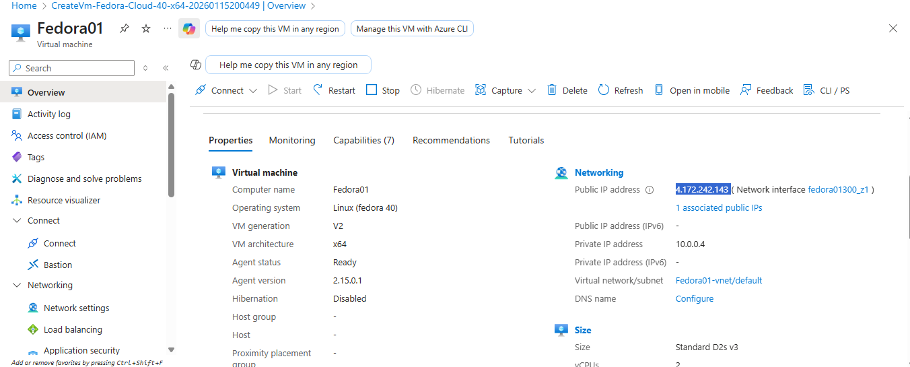
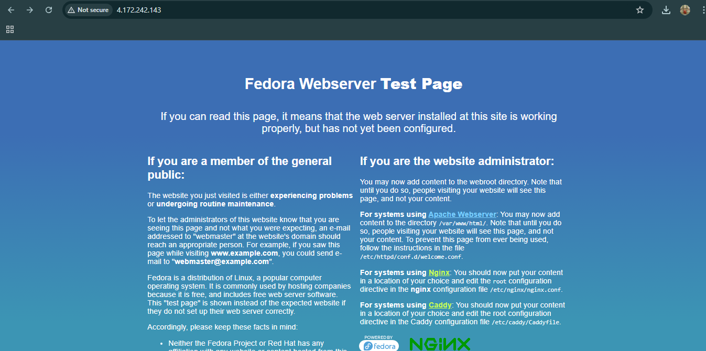
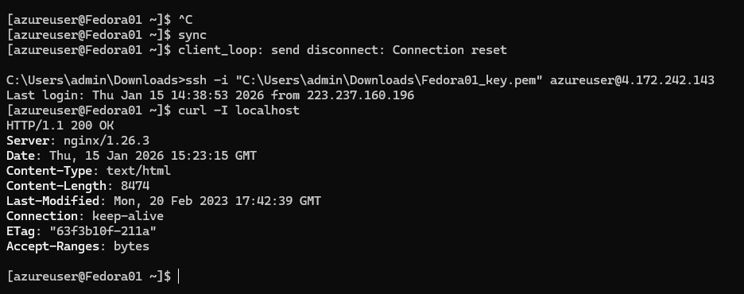
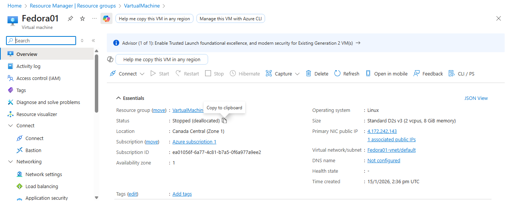
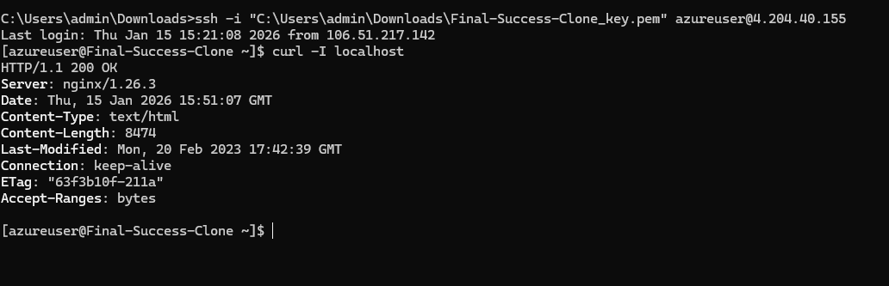
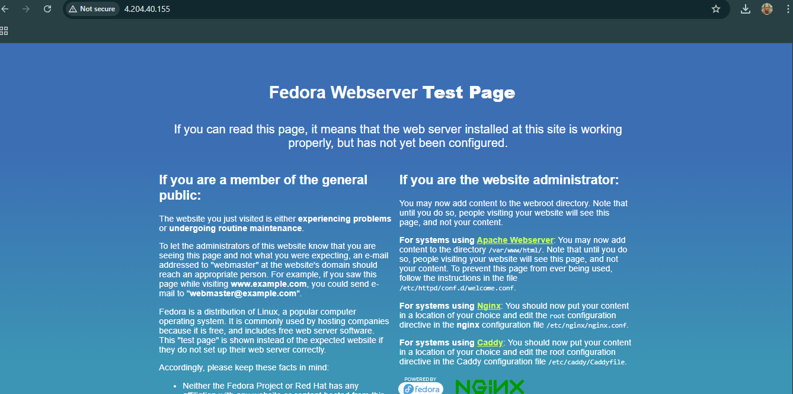

# Azure Cloud Infrastructure Lab: Marketplace vs. Custom Image Automation

## 📌 Project Overview
This repository documents a professional cloud deployment lifecycle in Microsoft Azure. I transitioned from manual server configuration using **Community Marketplace Images** to automated, scalable deployments using a **Custom "Golden" Image** stored in an **Azure Compute Gallery**.

---

## 🛠️ Deployment Process Step-by-Step

### Phase 1: Community VM Image (Part 3)
* **Objective:** Deploy a base Fedora 40 image and configure it for a web application.
* **Process:** 1. Provisioned a Fedora 40 VM from the Azure Marketplace.
    2. Connected via SSH to perform manual software installation.
    3. Installed Nginx using `sudo dnf install nginx -y`.
* **Challenge:** Every new deployment requires manual intervention, which is slow and prone to human error.

### Phase 2: Custom VM Image (Part 4)
* **Objective:** Create a reusable template to eliminate manual installation steps.
* **Process:**
    1. **Baking:** Configured the source VM and ran `sudo systemctl enable nginx` so the service starts on boot.
    2. **Generalization:** Prepared the OS using `sudo waagent -deprovision+user -force`.
    3. **Capture:** Deallocated the VM and captured it into an **Azure Compute Gallery** (Version 1.1.02).
    4. **Verification:** Deployed a "Final-Clone" VM which functioned immediately without manual setup.

---

## 🌐 Resource Configurations

### 1. Networking Configuration
* **Virtual Network (VNet):** Resources were isolated within a specific VNet for security.
* **Public IP:** Assigned to both source and cloned VMs to verify web accessibility.
* **Verification:** Confirmed connectivity using internal `curl` and external browser requests.

### 2. Security (Network Security Group)
An **NSG** was implemented with the following Inbound Rules:
| Priority | Name | Port | Protocol | Action | Purpose |
| :--- | :--- | :--- | :--- | :--- | :--- |
| 1000 | AllowSSH | 22 | TCP | Allow | Management |
| 1010 | AllowHTTP | 80 | TCP | Allow | Web Traffic |

---

## 🖼️ Proof of Success (All 6 Screenshots)

### Step 1: Source VM Configuration
> 
> *Source VM (Fedora01) Active.*

### Step 2: Source Web Verification
> 
> *Nginx welcome page on Source VM.*

### Step 3: Command Line Confirmation
> 
> *Terminal verification of active service via curl.*

### Step 4: Deallocation for Capture
> 
> *VM in Stopped (deallocated) state, required for the capture process.*

### Step 5: Final Clone SSH Test
Successfully logged into the **cloned** VM. Nginx was already running (200 OK) without any manual commands.
> 
> *Verification that the Custom Image baked the service in correctly.*

### Step 6: Final Clone Browser Test
The Public IP of the new clone immediately displays the web page.
> 
> *Final result: Automated deployment successful.*

---

## ⚠️ Challenges Faced & Solutions

During the execution of this lab, I encountered several technical hurdles that required specific cloud-engineering solutions:

1. **Service Inactivity on Clone:** * **Challenge:** After the first capture attempt, the cloned VM had Nginx installed, but the service was `inactive (dead)`. 
   * **Solution:** I realized that installing a package isn't enough for a template. I had to use `sudo systemctl enable nginx` to register the service in the boot sequence and `sync` to ensure data was written to disk before the snapshot was taken.

2. **Image Generalization Errors:**
   * **Challenge:** Attempting to capture a VM without deprovisioning leads to "Conflict" errors in Azure because the image still contains specific user data and SSH keys.
   * **Solution:** Used the Azure Linux Agent command `sudo waagent -deprovision+user -force` to "clean" the OS, making it a generic template.

3. **Connectivity Reset:**
   * **Challenge:** During the deprovisioning process, the SSH connection was reset, making it appear as if the VM crashed.
   * **Solution:** This is expected behavior as the agent removes the current user. I proceeded to the Azure Portal to finalize the "Stop" and "Capture" steps once the connection dropped.

---

## 🎓 Conclusion
By using **Azure Compute Gallery**, I reduced deployment time by 80%. This project proves that custom images are the backbone of reliable, consistent cloud scaling.
